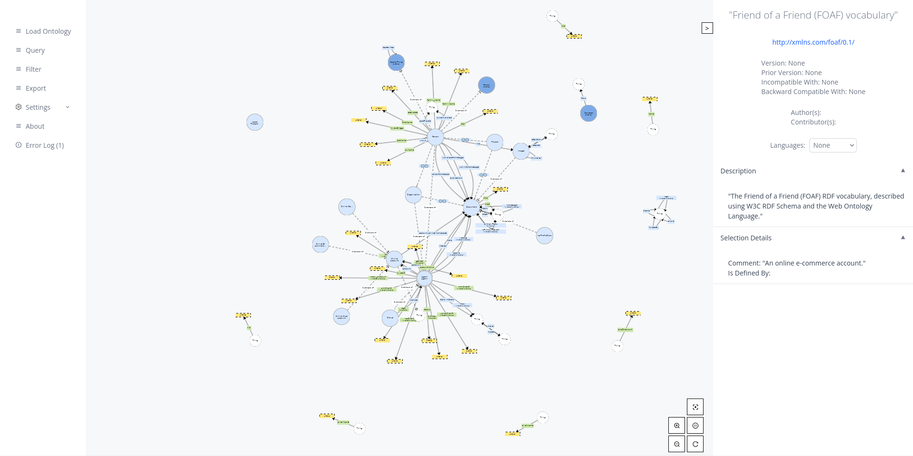
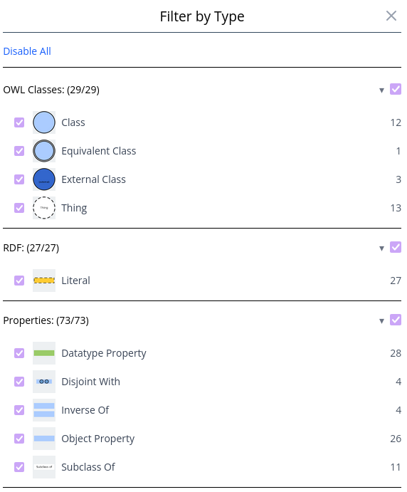

<h1 align="center">
  VOWLGrapher: WebVOWL Reimagined
</h1>

<h3 align="center">
A new VOWL-based ontology visualization tool designed with performance, extensibility, and usability in mind.
</h3>


(image showing VOWLGrapher **v0.2.0-beta**)

## Features

### Visualization

- Visualizes OWL, RDFS, RDF, and Dublin Core
- Parallellized force-directed graph simulation using the Barnes-Hut algorithm
- Hardware-accelerated rendering

### Filtering

- Interactive, type-based filtering supporting all constructs visualized.



### Custom SPARQL queries

> [!NOTE]
> Queries are currently restricted to variables `?s ?p ?o`

- Query the loaded graph and visualize the result
- Fetch and visualize data from external SPARQL endpoints

### Loading / Exporting

- Load ontologies from local file upload, URL, and SPARQL endpoints
    - Including optional recursive handling of`owl:imports`
- Supports loading and exporting to:
    - OWL
    - OWL Functional Syntax,
    - OWL/XML,
    - RDF/XML,
    - Turtle,
    - N-Triples,
    - N-Quads,
    - TriG,
    - JSON-LD,
    - N3

## Benchmarks

Performance is measured on:

- [FOAF](https://xmlns.com/foaf/spec/20140114.rdf)
- [GoodRelations](https://www.heppnetz.de/ontologies/goodrelations/v1.owl)
- [VIVO](https://raw.githubusercontent.com/vivo-ontologies/vivo-ontology/master/vivo.owl)
- [SIO](https://raw.githubusercontent.com/micheldumontier/semanticscience/master/ontology/sio/release/sio-release.owl)
- [SWEET](https://cor.esipfed.org/ont/api/v0/ont?format=rdf&iri=http://sweetontology.net/sweetAll)
- [ENVO](https://raw.githubusercontent.com/EnvironmentOntology/envo/master/envo.owl)
- [GO](https://purl.obolibrary.org/obo/go.owl)

Benchmarks are performed on a Windows 11 Home HP ENVY Laptop 13 with a 60 Hz screen refresh rate, 8 GB of RAM, and an Intel(R) Core(TM) i5-10210U CPU, running Google Chrome Version 147.0.7727.138 (64-bit). The backend runs on a server with Ubuntu 24.04, an AMD Ryzen(TM) 5 3600 CPU, 64 GB of RAM, and 4 TB SSD. Memory usage and FPS are measured using Chrome DevTools. The ontology size, in terms of triples, is measured by VOWLGrapher.

$\triangle$ indicates a time-out after 1 hour of loading.  
WebVOWL refers to [version 1.3.9](https://github.com/WebVOWL/WebVOWL-Legacy/tree/28e92c7220302c50aa32cebab977ab6e884d8887).

                           WebVOWL                  VOWLGrapher

| Ontology      | Triples   | FPS  |  Load (s)   | Mem. (MB) | FPS  | Load (s) | Mem. (MB) |
| :------------ | :-------- | :--: | :---------: | :-------: | :--: | :------: | :-------: |
| FOAF          | 631       |  60  |      2      |   16.8    |  60  |   $<1$   |   30.6    |
| GoodRelations | 1,834     |  31  |      3      |   24.8    |  60  |    1     |   33.4    |
| VIVO          | 6,810     |  10  |      3      |   59.3    |  57  |    2     |   53.3    |
| SIO           | 14,675    |  5   |      3      |    112    |  27  |    3     |   69.4    |
| SWEET         | 55,597    |  1   |     74      |    523    |  8   |    48    |    213    |
| ENVO          | 106,643   | $<1$ |      6      |    544    |  6   |    7     |    247    |
| GO            | 1,444,037 |  --  | $\triangle$ |    --     | $<1$ |   157    |   1,298   |

## Run using Docker

Pull image: `docker pull ghcr.io/webvowl/VOWLGrapher:latest`

Or use the [docker compose file](/docker-compose.yml) with command `docker-compose up -d`

### Building the docker image

0. Make sure Docker is installed
1. Clone the project locally
    ```
    git clone https://github.com/WebVOWL/VOWLGrapher.git
    ```
2. Make sure you're in the VOWLGrapher folder
    ```
    cd VOWLGrapher
    ```
3. Build the docker image
    ```
    docker build . -t vowlgrapher
    ```
4. Run the docker image
    ```
    docker run -p 8080:8080 vowlgrapher
    ```
5. Visit [http://localhost:8080](http://localhost:8080) to use VOWLGrapher

## Development setup

> [!NOTE]
> Using Linux is recommended

0. Clone the project locally
    ```
    git clone https://github.com/WebVOWL/VOWLGrapher.git
    ```
1. Install Rust from [https://www.rust-lang.org/tools/install](https://www.rust-lang.org/tools/install)
2. Install the following:
    ```bash
     apt install clang mold make cmake libssl-dev pkg-config
    ```
    Note that the package manager `apt` is used in the above command.
3. Run `cargo install leptosfmt`
4. Run `cargo install --locked cargo-leptos --version 0.3.6`
    > If you get a compile error `Can't locate FindBin.pm in @INC` you can either install Perl (e.g. `apt install perl`) or [download a prebuilt binary](https://github.com/leptos-rs/cargo-leptos/releases/latest)
5. Use the convenience shell file `build.sh` to build the project with different profiles based on the supplied argument. E.g. to build and run a development server, run `./build.sh dev`

## Environment variables

<details>
<summary>Help defining environment variables</summary>
Environment variables are defined like this:

```
<key=value> <key=value> ... <path/to/server/binary>
```

For instance:

```bash
VOWLGRAPHER_MAX_INPUT_SIZE_BYTES=50000000 RUST_BACKTRACE=1 RUST_LOG=info ./target/x86_64-unknown-linux-gnu/debug/vowlgrapher
```

</details>

The following environment variables are available:

|              Variable              |  Type   |    Default value    | Description                                                        |
| :--------------------------------: | :-----: | :-----------------: | :----------------------------------------------------------------- |
| `VOWLGRAPHER_MAX_INPUT_SIZE_BYTES` |  Bytes  | `52,428,800` (50MB) | The maximum allowed size, in bytes, of any input into VOWLGrapher. |
|   `VOWLGRAPHER_RESOLVE_IMPORTS`    | Boolean |       `false`       | Whether `owl:imports` should be fetched and loaded recursively.    |
